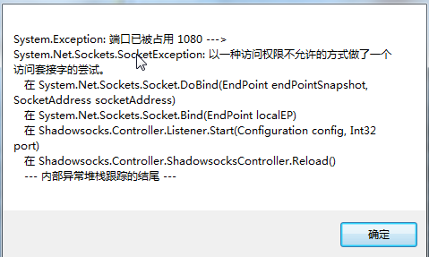

# 解决1080端口被占用

### 场景

在某些场景使用中，电脑显示1080端口被占用，当然其他端口也类似，如下




### 解决方案

#### 1. 找出是哪个程序占用了1080端口，关闭即可。

打开`cmd`控制台，输入

```bash
netstat -aon|findstr "1080"
```


最后一列对应地PID，也就是进程ID,再查看PID对应的是哪个程序

```bash
tasklist|findstr "4568"
```


图中可以看出有个淘宝的保护进程占用了1080端口,打开任务管理器，找到对应的进程，右键选择结束进程即可。


#### 2. 利用软件直接关闭进程。

软件：CurrPorts


下载地址：[http://www.nirsoft.net/utils/cports.html#DownloadLinks](http://www.nirsoft.net/utils/cports.html#DownloadLinks)


下载后解压，只要运行cports.exe文件，找到被占用的端口，右键选择`Close Selected TCP Connections`

