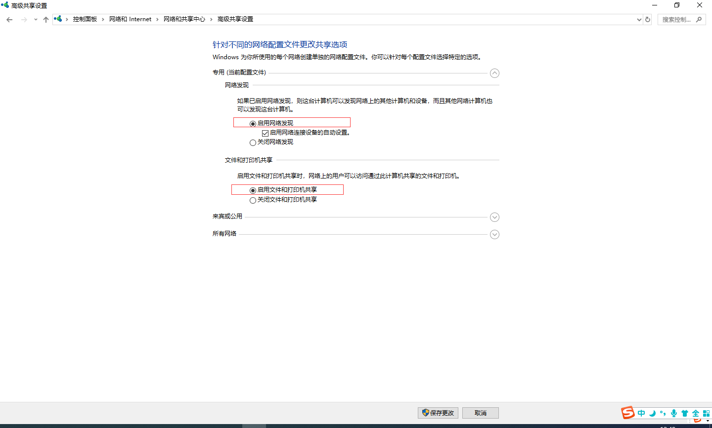
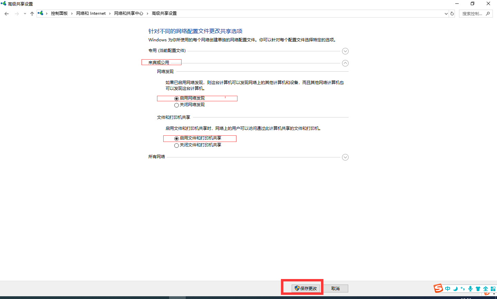
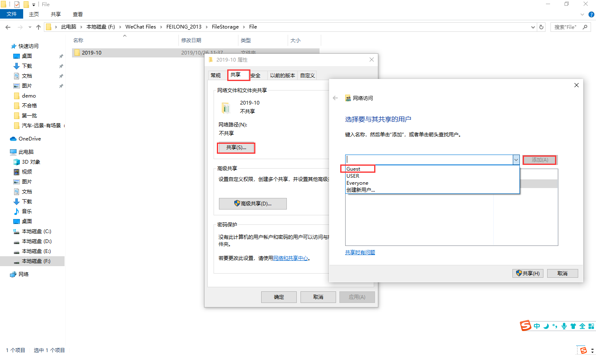
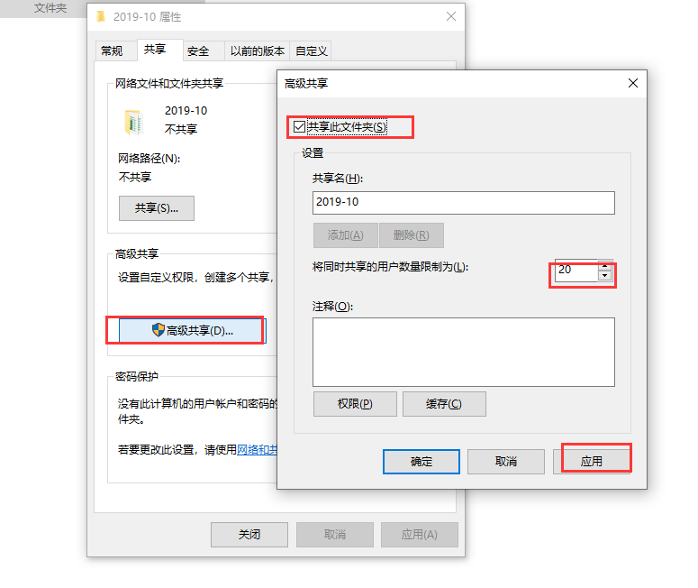

# 局域网设置通过IP共享文件

### 场景

公司内部常常进行大文件的传输，限于QQ限制，网盘速度慢的情况下，可以通过局域网内文件夹共享的方式进行传输。

### 测试条件

- 公司里电脑要在同一网段下，基本满足，因为同一个公司的都是用的自己公司的网。
- Win7系统或者Win10系统（**其它的应该也可以，没有测试**）

### 设置过程

**1.打开`控制面板`(可通过Win+S搜索控制面板）**

**2.点击`网络和Internet`**

**3.点击`更改高级共享设置`**

**4.专用选择`启动网络发现`和`启动文件和打印机共享`**

**5.来宾和公用选择`启动网络发现`和`启动文件和打印机共享`, 记得保存配置**

**6.选择想共享的文件夹，右击选择`属性`，里面选择`共享`，添加Guest，选择权限，根据实际需求来**

**7.然后高级共享，共享此文件夹，设置共享人数量，点击`应用`**

### 查看本机IP地址

Win+R 输入`ipconfig`,查找自己电脑的ip地址，同事就可以在`我的电脑`路径框里或者Win+R 输入\+ip访问你的共享文件夹了